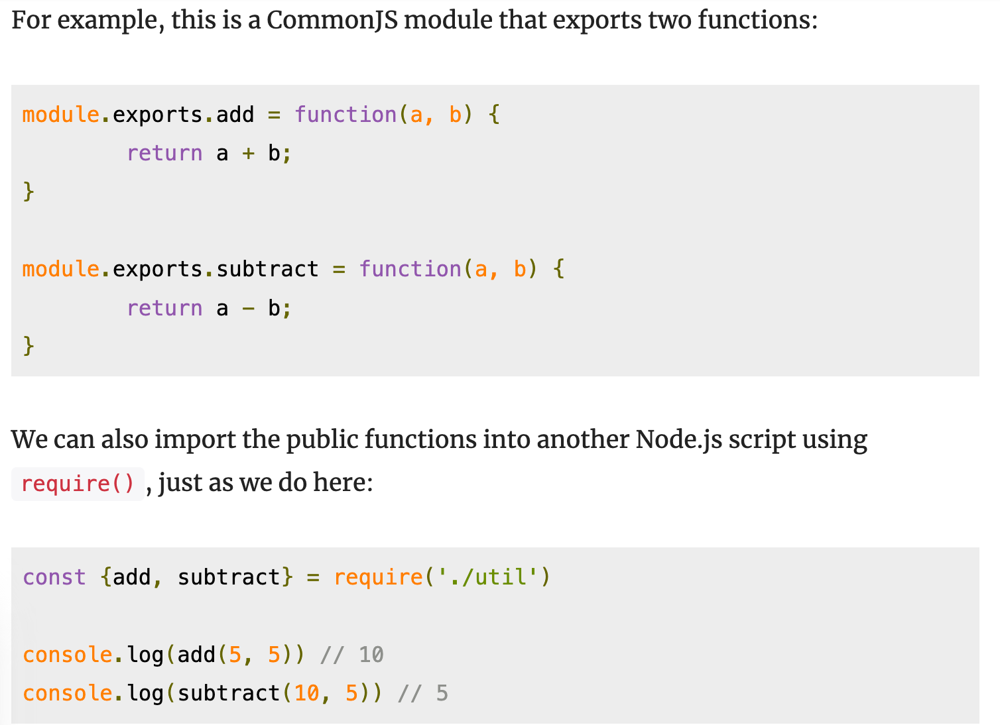
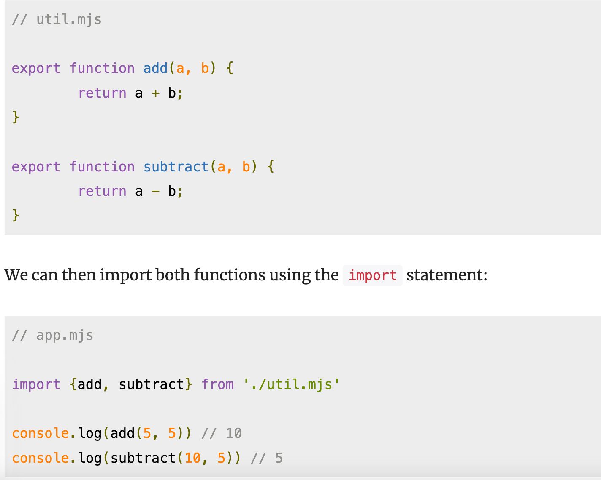
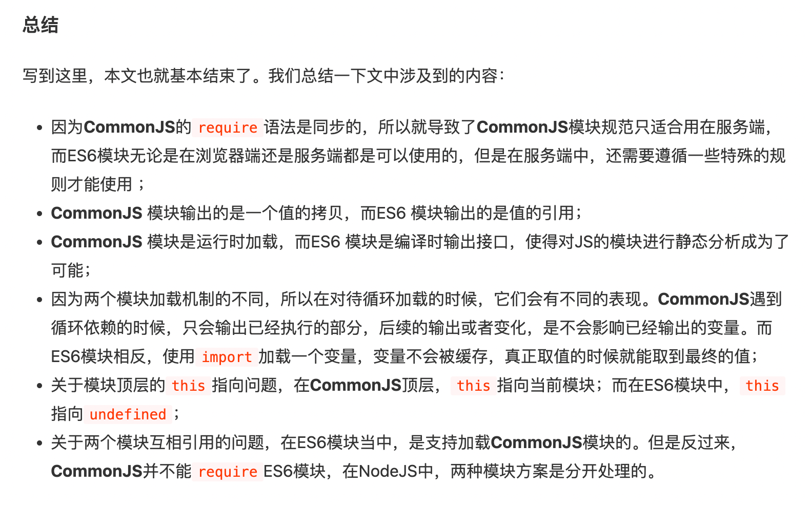

## ES6
由于JavaScript的标准——ECMAScript在不断发展，最新版ECMAScript 6标准（简称ES6）已经在2015年6月正式发布了，所以，讲到JavaScript的版本，实际上就是说它实现了ECMAScript标准的哪个版本。

## == ===
第一种是==比较，它会自动转换数据类型再比较，很多时候，会得到非常诡异的结果；

第二种是===比较，它不会自动转换数据类型，如果数据类型不一致，返回false，如果一致，再比较。

由于JavaScript这个设计缺陷，不要使用==比较，始终坚持使用===比较。

## NaN
另一个例外是NaN这个特殊的Number与所有其他值都不相等，包括它自己：

唯一能判断NaN的方法是通过isNaN()函数：
```
0/0 -> NaN
2/0 -> Infinity
```

## ES6模板字符串

```js
// 之前字符串拼接
var message = '你好, ' + name + ', 你今年' + age + '岁了!';

// 反引号 模版字符串
message = `你好, ${name}, 你今年${age}岁了!`;
```

## 对象
JavaScript规定，访问不存在的属性不报错，而是返回undefined
```js
var xiaohong = {
    name: '小红',
    'middle-school': 'No.1 Middle School'
};
//xiaohong的属性名middle-school不是一个有效的变量，
// 就需要用''括起来。访问这个属性也无法使用.操作符，必须用['xxx']来访问

'name' in xiaoming; // true

```

要判断一个属性是否是xiaoming自身拥有的，而不是继承得到的，可以用hasOwnProperty()方法：

```js
var xiaoming = {
    name: '小明'
};
xiaoming.hasOwnProperty('name'); // true
xiaoming.hasOwnProperty('toString'); // false

```


## 导入
common js module


es6 module


https://juejin.cn/post/6844904067651600391
